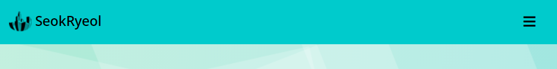
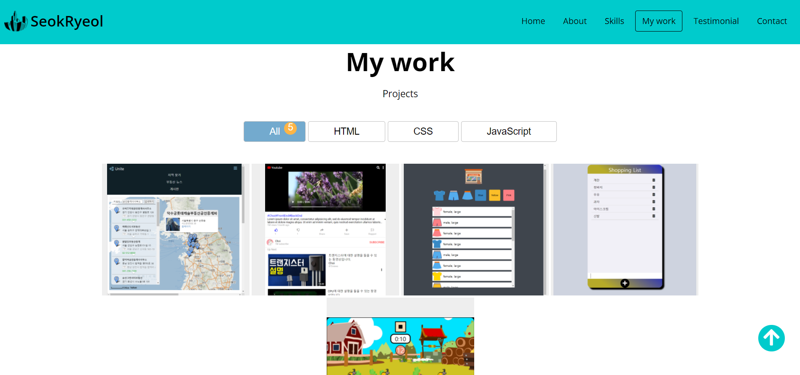
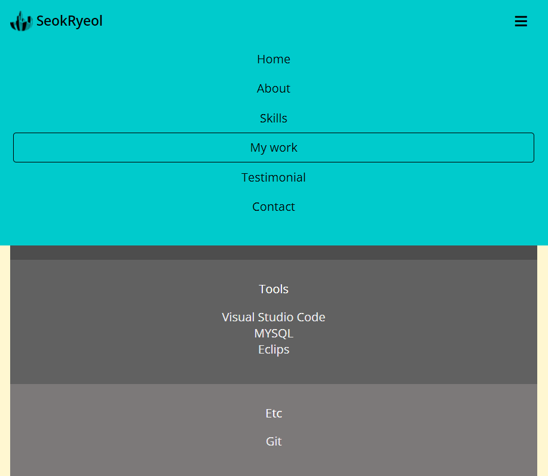
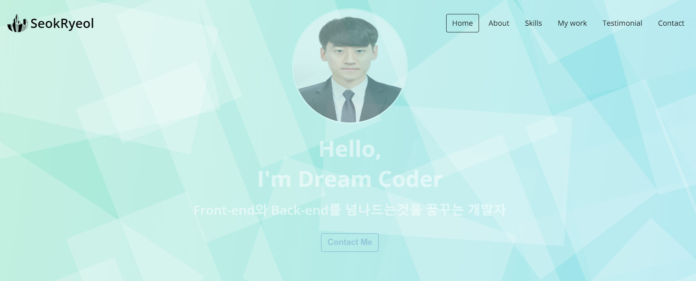
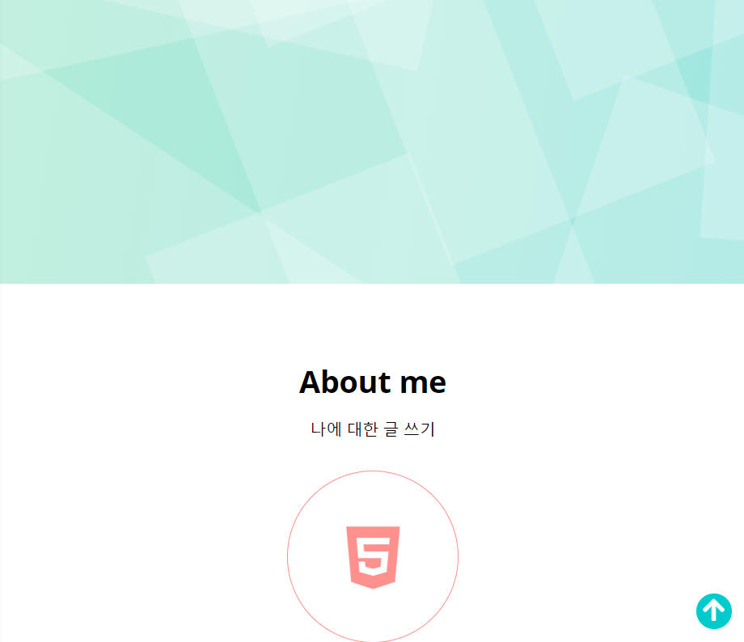
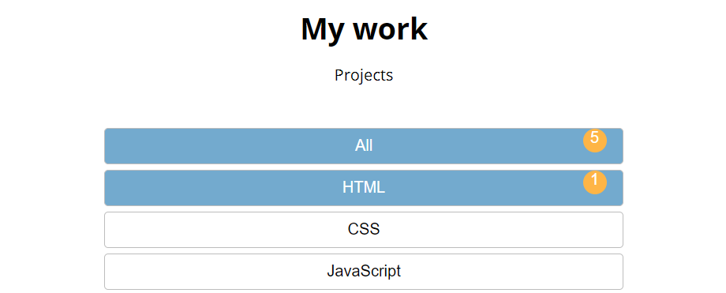
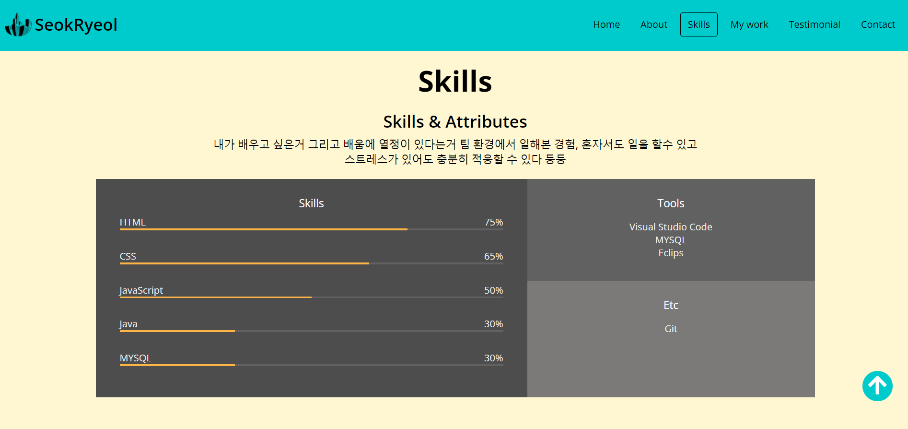

# Portfolio

```JavaScript
// 스크롤을 내릴시 navbar에 어두운 색 navbar가 생성
const navbar = document.querySelector('#navbar');
const navbarHeight = navbar.getBoundingClientRect().height;
document.addEventListener('scroll', () => {
    if(window.scrollY > navbarHeight) {
        navbar.classList.add('navbar--dark'); // navbar에 navbar--dark라는 class를 만든다 
    } else {
        navbar.classList.remove('navbar--dark');
    }
});

```


***

 ```JavaScript
//  메뉴 버튼을 누를시 해당 페이지로 이동 할 수 있는 기능
const navbarMenu = document.querySelector('.navbar__menu');
navbarMenu.addEventListener('click', (event) => {
    const target = event.target;
    const link = target.dataset.link;
    if(link == null) {
        return;
    }

    navbarMenu.classList.remove('open');
    scrollIntoView(link);
    selectNavItem(target);
});

// 메뉴 클릭시 스크롤이 smooth하게 이동하게 되고 
function scrollIntoView(selector) {
    const scrollTo = document.querySelector(selector);
    scrollTo.scrollIntoView({behavior: 'smooth'});
    selectNavItem(navItems[sectionIds.indexOf(selector)]);
};

// Home페이지에 Contact me 클릭시 Contact 페이지로 이동
const homeContactBtn = document.querySelector('.home__contact');
homeContactBtn.addEventListener('click', (event) => {
    scrollIntoView('#contact');
});

// 선택된 메뉴에 ㅁ 표시가 유지된다
let selectedNavIndex;
let selectedNavItem = navItems[0];
function selectNavItem(selected) {
    selectedNavItem.classList.remove('active');
    selectedNavItem = selected;
    selectedNavItem.classList.add('active');
};

```


***

```JavaScript
// 반응형 웹에서 토글 버튼 클릭시 메뉴창 생성
const navbarToggleBtn = document.querySelector('.navbar__toggle__btn');
navbarToggleBtn.addEventListener('click', () => {
    navbarMenu.classList.toggle('open');
});

```


***

```JavaScript
// 창이 아래로 스크롤될 때 Home페이지가 천천히 투명
const home = document.querySelector('.home__container');
const homeHeight = home.getBoundingClientRect().height;
document.addEventListener('scroll', () => {
    home.style.opacity = 1 - window.scrollY / homeHeight;
});

```


***

```JavaScript
// 오른쪽 아래에 위치한 arrow-up 버튼을 Home페이지 반이상 내려갈을때 표시
const arrowUp = document.querySelector('.arrow-up');
document.addEventListener('scroll', () => {
    if(window.scrollY > homeHeight / 2) {
        arrowUp.classList.add('visible');
    } else {
        arrowUp.classList.remove('visible');
    }
});

// arrow-up 버틀 클릭시 Home 페이지로 이동
arrowUp.addEventListener('click', (event) => {
    scrollIntoView('#home');
});

```


***

```JavaScript
// 프로젝트를 각자 카테고리에 분리 (HTML, CSS, JavaScript)
const workBtnContainer = document.querySelector('.work__categories');
const projectContainer = document.querySelector('.work__projects');
const projects = document.querySelectorAll('.project');
workBtnContainer.addEventListener('click', (event) => {
    const filter = event.target.dataset.filter || event.target.parentNode.dataset.filter;
    if(filter == null) {
        return;
    }

    // project에 애니메이션을 추가하고 애니메이션을 클릭해도 선택이 가능
    const active = document.querySelector('.category__btn.selected');
    active.classList.remove('selected');
    const target = event.target.nodeName === "BUTTON" ? event.target :
                    event.target.parentNode;
    target.classList.add('selected');

    projectContainer.classList.add('anim-out');

    setTimeout(() => {
        projects.forEach((project) => {
            if(filter === '*' || filter === project.dataset.type) {
                project.classList.remove('invisible');
            } else {
                project.classList.add('invisible');
            }
        });
        projectContainer.classList.remove('anim-out');
    }, 300)

});

```


***

```JavaScript
// 스크롤을 내리면 해당 페이지에 맞게 메뉴 section에 ㅁ 표시
const sectionIds = [
    '#home',
    '#about', 
    '#skills', 
    '#work', 
    '#testimonials', 
    '#contact'
];
const sections = sectionIds.map(id => document.querySelector(id));
const navItems = sectionIds.map(id => document.querySelector(`[data-link="${id}"]`));

const observerCallback = (entries, observer) => {
    entries.forEach(entry => {
        if(!entry.isIntersecting && entry.intersectionRatio > 0) {
            const index = sectionIds.indexOf(`#${entry.target.id}`);
            if(entry.boundingClientRect.y < 0) {
                selectedNavIndex = index + 1;
            } else {
                selectedNavIndex = index - 1;
            }
        }
    });
};
// 화면에 들어오는 section과 나가는 section을 관찰하는 역할
const observer = new IntersectionObserver(observerCallback, observerOptions);
sections.forEach(section => observer.observe(section));

// 보여지는 섹션에 해당하는 메뉴 아이템을 활성화 시킨다
window.addEventListener('wheel', () => {
    if(window.scrollY === 0) {
        selectedNavIndex = 0;
    } else if (
        Math.round(window.scrollY + window.innerHeight) >= 
        document.body.clientHeight) {
            selectedNavIndex = navItems.length - 1;
    } 
    selectNavItem(navItems[selectedNavIndex]);
});

```


***
