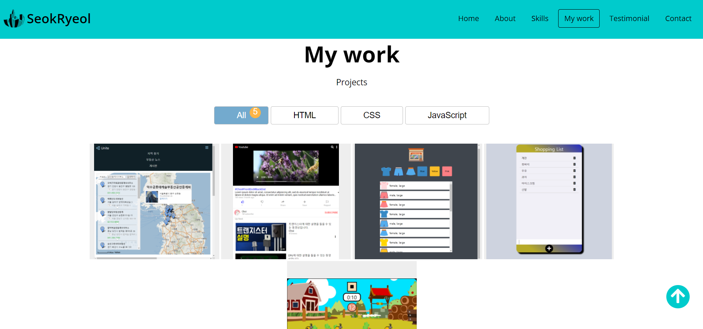

# Portfolio

```JavaScript
// 스크롤을 내릴시 navbar에 어두운 색 navbar가 생성
const navbar = document.querySelector('#navbar');
const navbarHeight = navbar.getBoundingClientRect().height;
document.addEventListener('scroll', () => {
    if(window.scrollY > navbarHeight) {
        navbar.classList.add('navbar--dark'); // navbar에 navbar--dark라는 class를 만든다 
    } else {
        navbar.classList.remove('navbar--dark');
    }
});
```


---
---

 ```JavaScript
//  메뉴 버튼을 누를시 해당 페이지로 이동 할 수 있는 기능
const navbarMenu = document.querySelector('.navbar__menu');
navbarMenu.addEventListener('click', (event) => {
    const target = event.target;
    const link = target.dataset.link;
    if(link == null) {
        return;
    }

    navbarMenu.classList.remove('open');
    scrollIntoView(link);
    selectNavItem(target);
});

// 메뉴 클릭시 스크롤이 smooth하게 이동하게 되고 
function scrollIntoView(selector) {
    const scrollTo = document.querySelector(selector);
    scrollTo.scrollIntoView({behavior: 'smooth'});
    selectNavItem(navItems[sectionIds.indexOf(selector)]);
};

// 선택된 메뉴에 ㅁ 표시가 유지된다
let selectedNavIndex;
let selectedNavItem = navItems[0];
function selectNavItem(selected) {
    selectedNavItem.classList.remove('active');
    selectedNavItem = selected;
    selectedNavItem.classList.add('active');
};
```


---
---
